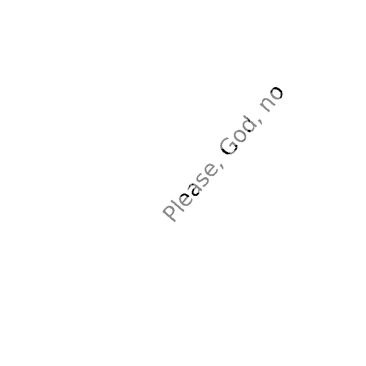

# ProceduralImagePainter

CLI tool that renders a phrase repeatedly over a black-and-white image as typographic halftone art. Text over dark source pixels is painted black; text over light pixels is painted gray. The original image emerges from the contrast between the two tones.

Output is an **animated GIF** that builds up progressively — early frames show just a few phrases, later frames fill the canvas.

## Installation

```bash
uv sync
```

Requires Python 3.10+ and fonts under `/usr/share/fonts` (or a custom directory).

## Usage

```bash
uv run painter INPUT_IMAGE PHRASE OUTPUT.gif [OPTIONS]
```

### Options

| Option | Default | Description |
|---|---|---|
| `--font-dir` | `/usr/share/fonts` | Directory to search for TTF/OTF fonts |
| `--min-size` | `12` | Minimum font size in pixels |
| `--max-size` | `48` | Maximum font size in pixels |
| `--max-rotation` | `60.0` | Max rotation angle in degrees (both directions) |
| `--coverage` | `0.85` | Target canvas coverage fraction (0.0–1.0) |
| `--gray-shade` | `140` | Gray value (0–255) for text over light areas |
| `--threshold` | `0.5` | Luminance threshold: below = black text, above = gray text |
| `--seed` | `None` | Random seed for reproducible output |
| `--verbose` | `False` | Print progress updates |

## Examples



## How it works

1. The source image is loaded as a grayscale luminance map (0 = black, 1 = white).
2. The canvas starts fully white.
3. Each iteration picks a random position, rotation, font, and size; renders the phrase as a text mask; and paints it onto the canvas — black where the source is dark, gray where it is light.
4. Phrases are always placed so they fit entirely within the canvas bounds.
5. The loop stops when the target coverage fraction is reached (or after 5000 consecutive placements that add no new pixels).
6. Frames are captured at a ~1.25× growing interval (1, 2, 3, 4, 5, 6, 8, 10, 12, 15, …) and saved as an animated GIF.
